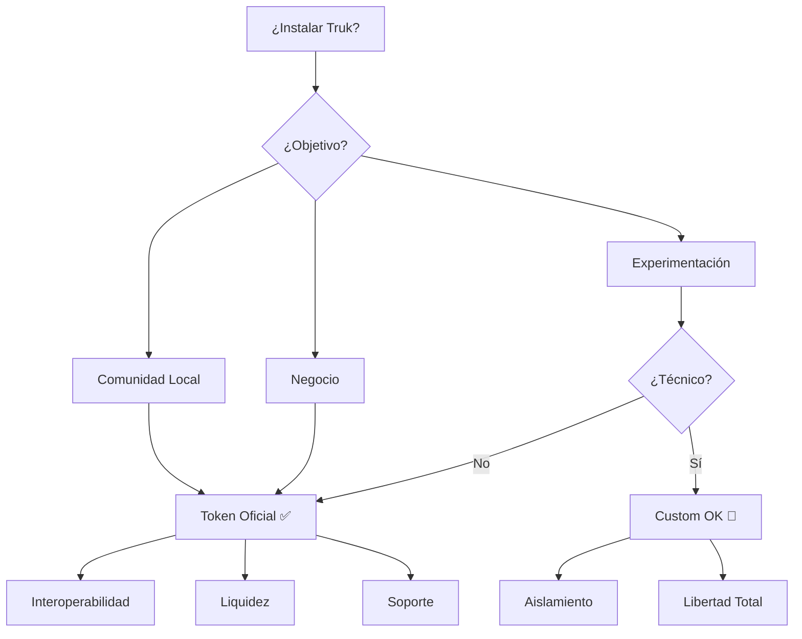

# 🪙 Guía de Tokenomics - Truk

## Resumen Ejecutivo

Esta guía explica cómo funciona el sistema económico de Truk cuando alguien hace un fork o instala su propia instancia de la plataforma. Comprende las implicaciones de usar el token oficial SEMILLA vs deployar tu propio token.

---

## 🌐 Arquitectura Económica de Truk

Truk utiliza un sistema económico **híbrido de tres capas**:

### 1. **SEMILLA** - Token Blockchain Global 🌍
```
Tipo: ERC-20 (Polygon) + SPL Token (Solana)
Alcance: Global (todas las instalaciones)
Función: Interoperabilidad blockchain
```

**Características:**
- Token compartido entre TODAS las instalaciones de Truk
- Permite bridges a DeFi (Uniswap, Raydium, etc.)
- Value storage a largo plazo
- Cotizable en DEXes

### 2. **CREDITS** - Moneda Social Local 💚
```
Tipo: Base de datos local (PostgreSQL)
Alcance: Por instalación
Función: Economía colaborativa local
```

**Características:**
- Cada instalación tiene sus PROPIOS créditos
- No son intercambiables directamente entre instalaciones
- Generados por contribución al bien común
- Demurrage opcional (pierde valor con el tiempo)

### 3. **TIME_HOURS** - Banco de Tiempo ⏰
```
Tipo: Base de datos local (PostgreSQL)
Alcance: Por instalación
Función: Economía del cuidado
```

**Características:**
- 1 hora = 1 hora (igualdad radical)
- No acumulables indefinidamente
- Valoriza todo trabajo por igual

---

## 🔑 Opciones al Instalar Truk

Cuando alguien instala Truk usando el instalador gráfico, tiene dos opciones principales:

### Opción A: **Usar Token SEMILLA Oficial** ✅ (Recomendado)

```typescript
// Configuración automática durante instalación
SEMILLA_TOKEN_ADDRESS = "0x..." // Contrato oficial en Polygon
SEMILLA_MINT_ADDRESS  = "Abc..." // Token oficial en Solana
FEDERATION_ENABLED    = true
COMMUNITY_DID         = "did:truk:uuid-unico"
```

**¿Qué significa esto?**

| Aspecto | Resultado |
|---------|-----------|
| **Token SEMILLA** | Compartes el MISMO token con todas las instalaciones de Truk |
| **Créditos Locales** | Son ÚNICOS de tu instalación |
| **Liquidez** | Puedes intercambiar SEMILLA en DEXes públicos |
| **Interoperabilidad** | Puedes hacer bridges con otras instalaciones |
| **Federation** | Tu instalación se conecta a la red Truk global |
| **Control** | TÚ controlas tu instalación, PERO usas infraestructura compartida |

**Ventajas:**
- ✅ Network effects: más usuarios = más valor
- ✅ Liquidez compartida en DEXes
- ✅ Soporte oficial y actualizaciones
- ✅ Interoperabilidad automática
- ✅ Listado en exchanges (futuro)

**Desventajas:**
- ⚠️ Dependes del token oficial
- ⚠️ No controlas la emisión de SEMILLA

### Opción B: **Deployment Personalizado** 🔧 (Avanzado)

```typescript
// Configuración manual después de instalación
CUSTOM_DEPLOYMENT = true
// Debes deployar tus propios contratos
```

**¿Qué significa esto?**

| Aspecto | Resultado |
|---------|-----------|
| **Token SEMILLA** | Creas tu PROPIO token (no es SEMILLA real) |
| **Créditos Locales** | Son ÚNICOS de tu instalación |
| **Liquidez** | Debes crear tu propia liquidez |
| **Interoperabilidad** | NO compatible con otras instalaciones de Truk |
| **Federation** | Opcional, pero sin token compartido |
| **Control** | Control TOTAL sobre tu economía |

**Ventajas:**
- ✅ Autonomía completa
- ✅ Experimentación libre
- ✅ Sin dependencias externas

**Desventajas:**
- ❌ Sin interoperabilidad automática
- ❌ Sin liquidez inicial
- ❌ Requiere conocimientos técnicos avanzados
- ❌ Sin soporte oficial
- ❌ Fragmentación de valor

---

## 🤔 Preguntas Frecuentes

### Q1: Si uso el token oficial, ¿pierdo el control de mi instalación?

**R:** NO. Tu instalación es completamente independiente. Solo compartes el token SEMILLA en blockchain, pero:
- Tu base de datos es tuya
- Tus usuarios son tuyos
- Tus créditos locales son únicos
- Puedes desconectarte cuando quieras

Es como usar Bitcoin: compartes la blockchain, pero tu wallet es tuya.

### Q2: ¿Cómo se valora SEMILLA si hay múltiples instalaciones?

**R:** SEMILLA es un token único en blockchain pública. Su valor se determina por:
1. Oferta y demanda en DEXes
2. Utilidad en TODAS las instalaciones
3. Network effects: más comunidades = más valor
4. Governance descentralizada (Proof-of-Help)

### Q3: ¿Qué pasa con mis créditos locales si otra instalación cierra?

**R:** NADA. Los créditos locales están aislados por instalación. Si la instalación X cierra, solo afecta a los usuarios de X, no a los tuyos.

### Q4: ¿Puedo convertir mis créditos locales en SEMILLA?

**R:** SÍ, mediante bridges internos. La tasa de conversión la define cada instalación:

```typescript
// Ejemplo de conversión
1 SEMILLA = 100 CREDITS (tasa definida localmente)
1 SEMILLA = 10 TIME_HOURS (opcional)
```

### Q5: ¿Cómo funciona la federación entre instalaciones?

**R:** Mediante dos protocolos:

**ActivityPub:** Para comunicación social
```
Instalación A ←→ ActivityPub ←→ Instalación B
```

**Mutual Credit (Círculos):** Para intercambios económicos
```
Usuario A (Instancia 1) envía valor → Usuario B (Instancia 2)
```

### Q6: Si fork el proyecto, ¿puedo comercializar mi propia versión?

**R:** SÍ, Truk es MIT License. Puedes:
- ✅ Hacer fork del código
- ✅ Modificarlo como quieras
- ✅ Usar token oficial O crear el tuyo
- ✅ Cobrar por hosting/soporte
- ✅ Crear una empresa alrededor

**PERO:**
- ⚠️ Si usas token oficial, sigues las reglas de governance
- ⚠️ Debes mantener la licencia MIT en el código
- ⚠️ No puedes usar la marca "Truk" sin permiso

---

## 💡 Modelo de Monetización Recomendado

Si quieres crear un negocio con Truk:

### Modelo 1: **Hosting como Servicio (SaaS)**
```
Código: Open Source
Token: Oficial SEMILLA
Revenue: Hosting + soporte
```

Ofreces:
- Hosting gestionado de instalaciones
- Backups automáticos
- Soporte técnico
- Customización visual

Precio ejemplo: €50/mes por comunidad

### Modelo 2: **Consultoría e Implementación**
```
Código: Open Source
Token: Oficial SEMILLA
Revenue: Servicios profesionales
```

Ofreces:
- Setup inicial
- Formación de administradores
- Integración con sistemas existentes
- Desarrollo de features custom

### Modelo 3: **Freemium + Premium Features**
```
Core: Gratis con token oficial
Premium: Pago con features avanzadas
```

Features premium ejemplos:
- Analytics avanzadas
- Integración con CRM/ERP
- Whitelabel completo
- SLAs garantizados

---

## 🎯 Recomendación Final

**Para la mayoría de casos, usa el token SEMILLA oficial:**



**Razones:**
1. Efecto de red: tu comunidad forma parte de un ecosistema mayor
2. Liquidez inmediata: SEMILLA cotiza en DEXes desde día 1
3. Interoperabilidad: intercambio con otras comunidades sin fricción
4. Actualizaciones y soporte oficial
5. Menores barreras de entrada para usuarios

---

## 📚 Recursos Adicionales

- [Whitepaper Completo](/packages/web/public/docs/WHITEPAPER.md)
- [Documentación del Bridge](/docs/blockchain/EXECUTIVE_BRIDGE_SUMMARY.md)
- [Federación Gailu Labs](/docs/integrations/IMPLEMENTACION_GAILU_LABS.md)
- [API Reference](/docs/technical/API_REFERENCE.md)

---

## 🤝 Contribuir

¿Tienes ideas para mejorar la tokenomics?
- Abre un issue en GitHub
- Únete a la governance descentralizada
- Propón cambios vía Proof-of-Help

---

> "La tecnología debería empoderar a las comunidades, no fragmentarlas."
>
> — Equipo Truk
